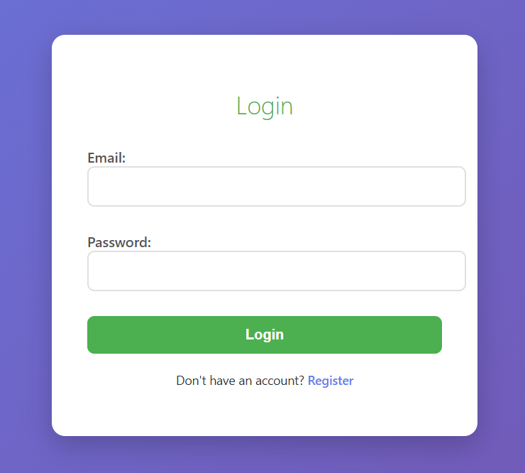
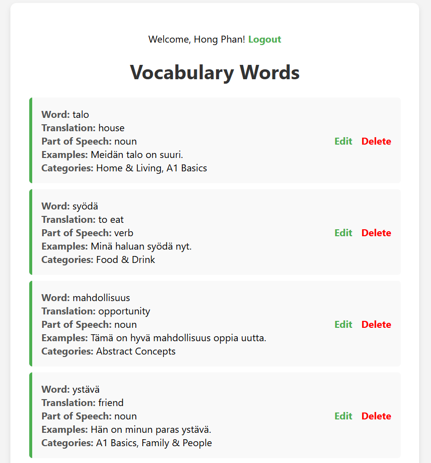
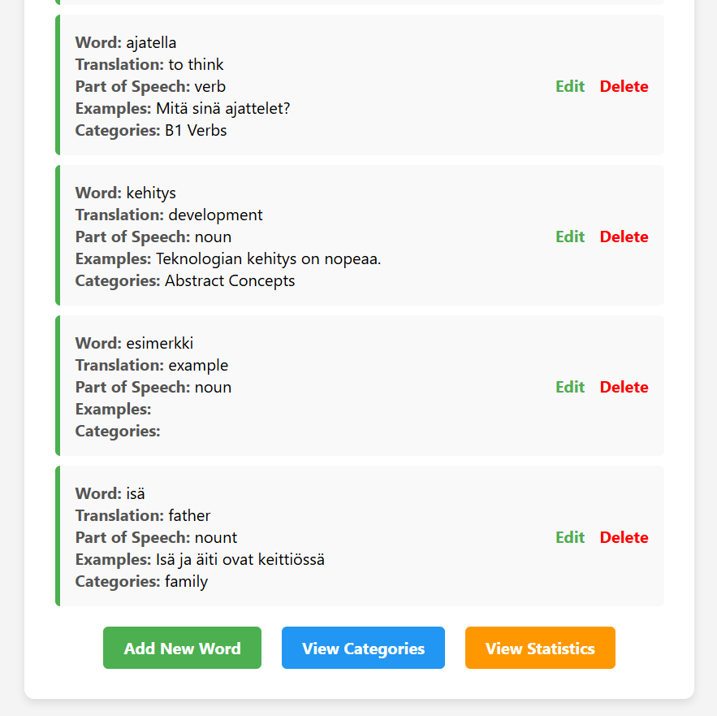
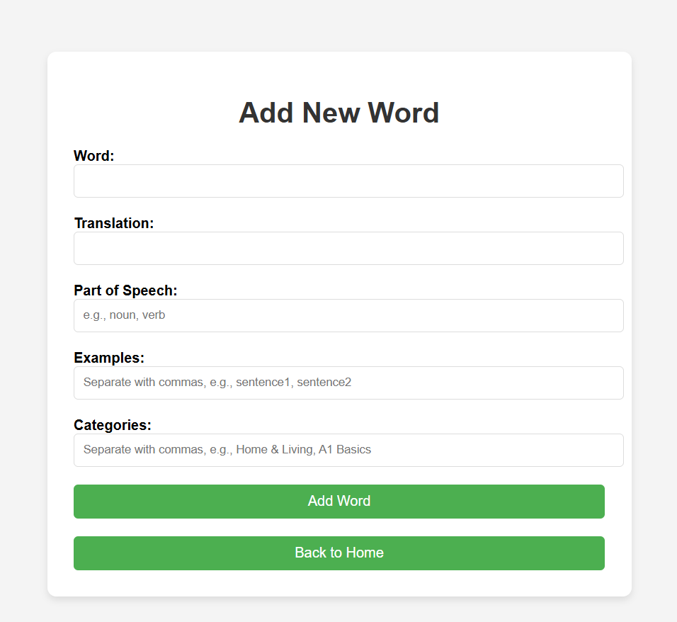
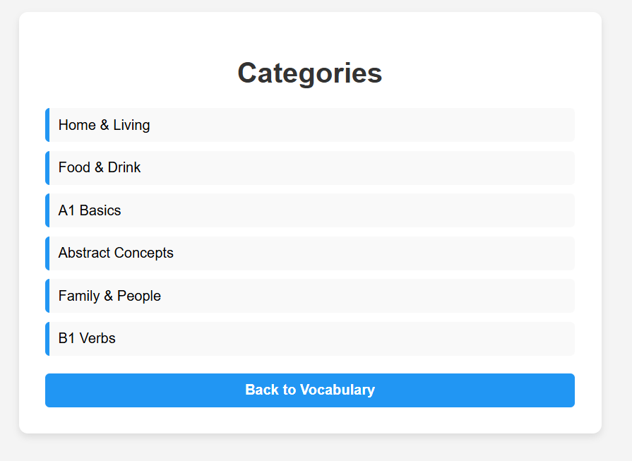

# Vocabulary Management App

A Flask-based web application for managing vocabulary words with MongoDB, featuring user authentication, CRUD operations, categories, and statistics.

## Features

- **User Authentication**: Register and login to access the app
- **Vocabulary Management**: Add, edit, delete, and view vocabulary words
- **Categories**: View available word categories
- **Statistics**: See total counts of vocabulary, categories, and users
- **Responsive Design**: Clean, consistent UI with inline CSS

## Screenshots







## Technologies Used

- **Backend**: Python, Flask
- **Database**: MongoDB with PyMongo
- **Authentication**: Flask-Login, Werkzeug (for password hashing)
- **Frontend**: HTML, CSS (inline styles)

## Installation

1. **Clone the repository**:

   ```bash
   git clone https://github.com/Janphan/MongoDB-with-Python-Project.git
   cd MongoDB-with-Python-Project
   ```

2. **Install dependencies**:

   ```bash
   pip install Flask pymongo python-dotenv Flask-Login werkzeug
   ```

3. **Set up MongoDB**:

   - Ensure MongoDB is running locally on `mongodb://localhost:27017/`
   - Or update the `MONGODB_URI` in `.env`

4. **Configure environment variables**:
   Create a `.env` file in the root directory:

   ```
   MONGODB_URI=mongodb://localhost:27017/
   MONGODB_DATABASE=Vocabulary-finnish
   SECRET_KEY=your-secret-key-here
   ```

5. **Run the application**:

   ```bash
   python main.py
   ```

6. **Access the app**:
   Open your browser and go to `http://localhost:5000`

## Usage

1. **Register**: Create a new account at `/register`
2. **Login**: Log in with your credentials at `/login`
3. **Manage Vocabulary**:
   - View all words on the home page
   - Add new words via "Add New Word"
   - Edit or delete existing words
4. **View Categories**: Check available categories
5. **View Statistics**: See overall counts

## Database Structure

- **vocabulary**: Stores words with fields like word, translation, partOfSpeech, examples, categories
- **categories**: Stores category names and descriptions
- **users**: Stores user accounts with name, email, hashed password

## Contributing

Feel free to submit issues or pull requests for improvements.

## License

This project is open-source. Use at your own risk.</content>
<filePath>c:\Hong\Haaga\2024-2025\noSQL\MongoDB-with-Python-Project\README.md
